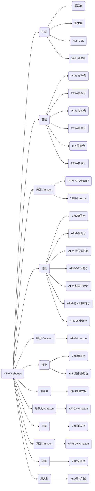

# 仓储疑问

## 1. 入库管理

### 1.1 入库验收

- 托和箱的对应关系？

0箱0托是什么情况。至少要1箱1托吗？

一托应该可以对应多个箱子吧？[货物组托是什么？ - 知乎 (zhihu.com)](https://www.zhihu.com/question/301265449)

- 异常主单号是什么？

- 到料签收 的 几种状态

未签收：未到货、部分到货（**清点**流程？）

已签收：已到货

已废弃：废弃（多久算废弃呢？）

- 验收入库 的 几种状态

部分已判、整单已判 ‘处理位移’；红色的、蓝色的

横的状态列表 和 数据竖着的状态 ，之间的关系，没看懂。【状态】

## 2 出入库作业

### 2.1 采购出入库

- 仓库的几种类型的区别

良品仓、代发仓、报关仓？

仓库是怎么建立起来

- 退货价格、含税价格、最新价格之间的关系
- 废弃的退货单，里面都是空的，是什么意思？

### 2.2 销售出入库

销售退货

### 2.3 调拨出入库

调拨运输方式：AIR、Express、LCL、

### 2.4 加工出入库

内部工作单号、外部单号（出入库单号、购买订单单号、）

配料出库、成品入库、加工单（将配料组装成成品？）成品入库数量大于配料的数量？

### 2.5 其他出入库

（出库单号？）借样出库、盘亏出库、

（入库单号？）借样还回、盘盈入库、

### 2.6 出入库明细

出库流水号、出库单号、

只有入库详情汇总（成品加工、移库、），怎么没有出库详情汇总呢？

### 2.7 移库管理

移库单号MV 、与 【调拨出入库（调拨单号TI）】的区别？

### 2.8 德国仓上架记录

空数据

## 3 库存管理

### 3.1 全部库存

120w库存数据（全部的SKU种类？）、全部的库位

### 3.2 异常库存

库存校准异常（和盘盈盘亏的区别？）327万条？！

### 3.3 良品库存管理

https://cloud.tencent.com/developer/article/1334691

### 3.4 库存日志

只有8条数据；

### 3.5 库位库存管理

库位在用库存、库位预占库存、库位可用库存；【仓库-子仓库】（良品仓）

### 3.6 在途明细

在途数量？

### 3.7 预占库存管理

【预占单号】

- 其他出库预占
- 配货预占
- 调拨单预占
- 海运剩余预占
- 销售订单预占

预占库位：待上架区、具体库位、海运剩余区

### 3.8  盘点计划

盘点任务 单号、盘盈盘亏、

## 4 报表

### 4.1 成本组成报表

【SKU、仓库】库存单价、物品成本单价、成本占比、海运费、港口费、空运费、手续费、保险费、进口关税、

### 4.2 月末调拨在途明细

版本日期？为什么是月末？

## 5 在库管理

### 5.1 在库异常管理

异常未处理；已完结。

【数量异常、质量异常、库位异常】

## 6 看板

### 6.1 仓库看板

- 库存货品可视化
  - 入库量
  - 出库量
  - 仓库
- 仓库流程可视化
  - 已签收
  - 待清点
  - 待抽验
  - 待复核
  - 待上架
  - 已完结
- 人员情况可视化
  - 工作量
  - 人数、人效

容器：
